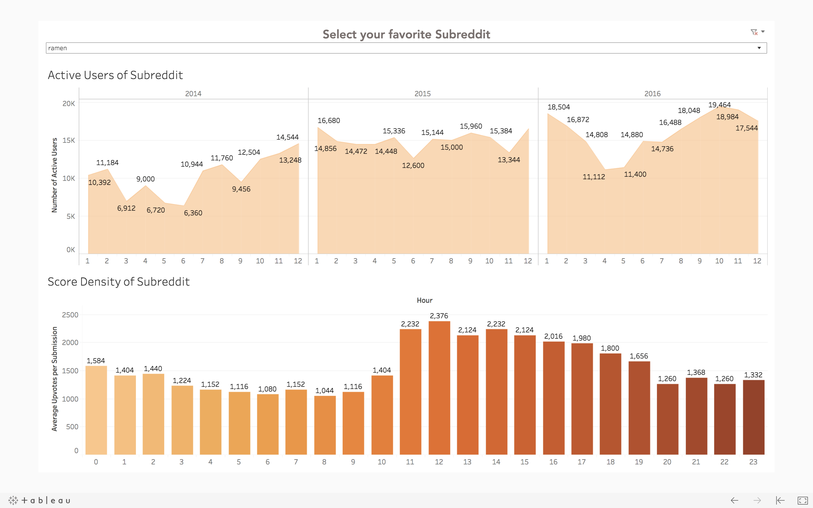
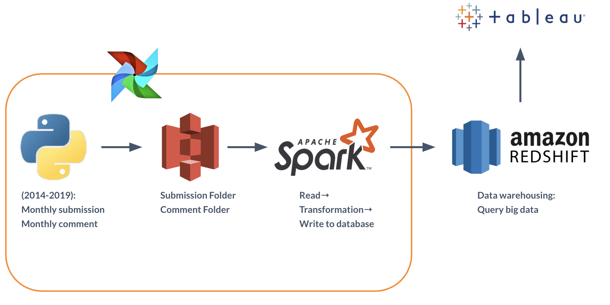

# Trending Reddit - Big data warehouse 

## Introduction
Reddit is the sixth-most-popular site in the United States. It’s a massive collection of forums, where people can share news and content or comment on other people’s posts. 

Reddit is broken up into more than a million communities known as "subreddits", which has grown up to 140 millions during the last five years. Each subreddit has a specific topic, such as technology, politics or music. Reddit's homepage, or the front page, as it is often called, is composed of the most popular posts from each default subreddit. Reddit site members, also known as redditors, submit content which is then voted upon by other members. The goal is to send well-regarded content to the top of the site's front page. Content is voted on via upvotes and downvotes which calculates as scores.

With explosively large informations generated everyday on Reddit, We can use it for Social Media Marketing, designing recommender systems in terms of different perspectives, machine learning and data analysis. It's worth the effort to design a data pipeline in order to process reddit data for building a big data warehouse which can provide those services above.

This is one use case for the big data warehouse. The first graph shows the number of active redditors under a subreddit monthly:

The first graph shows the number of active redditors under a specific subreddit monthly, the second graph represents the score density every hour for a specific subreddit, the score density is the total score devides total submission per hour, it provides you when you can get more upvotes if you want to post a submission under a subreddit. You can select whatever subreddit you are interested in with the dropdown list to show the statistics.

## Data Pipeline

## How does it work?
#### 1. S3: Download Data with boto3

#### 2. Spark: ETL
#### 3. Redshift: Data warehousing
#### 4. Tableau: Visualization
#### 5. Airflow: Automatic S3 and spark jobs monthly

## Data Source
Submissions and comments are stored seperately in two different folders on https://files.pushshift.io/reddit/

