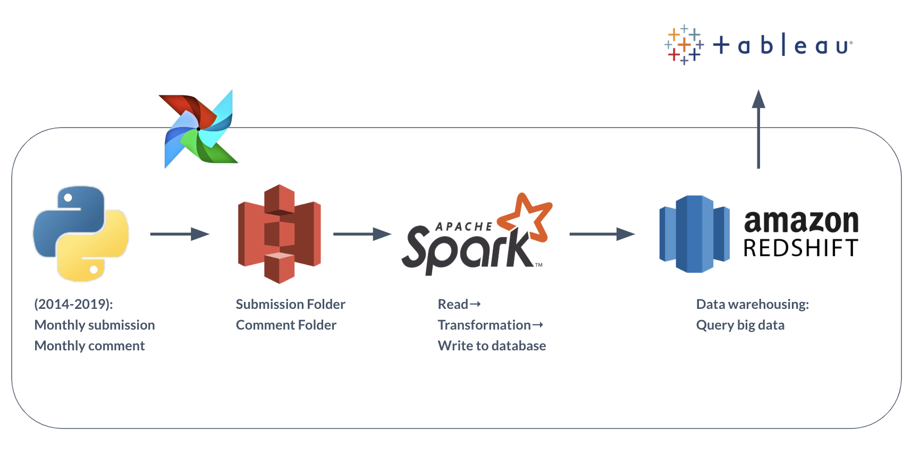

# Trending Reddit - Big data warehouse 
## Introduction
Reddit is the sixth-most-popular site in the United States. It’s a massive collection of forums, where people can share news and content or comment on other people’s posts. 

Reddit is broken up into more than a million communities known as "subreddits", which has grown up to 140 millions during the last five years. Each subreddit has a specific topic, such as technology, politics or music. Reddit's homepage, or the front page, as it is often called, is composed of the most popular posts from each default subreddit. Reddit site members, also known as redditors, submit content which is then voted upon by other members. The goal is to send well-regarded content to the top of the site's front page. Content is voted on via upvotes and downvotes which calculates as scores.

With explosively large informations generated everyday on Reddit, it's worth the effort to build a data warehouse which stores submissions and comments in a relational database at the same time provide insights for marketing and data science usage.

## Data Pipeline

## How does it work?
### 1. S3: Download Data with boto3
### 2. Spark: ETL
### 3. Redshift: Data warehousing
### 4. Tableau: Visualization

## Data Source
Submissions and comments are stored seperately in two different folders on https://files.pushshift.io/reddit/

